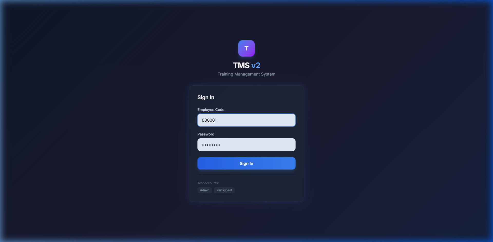
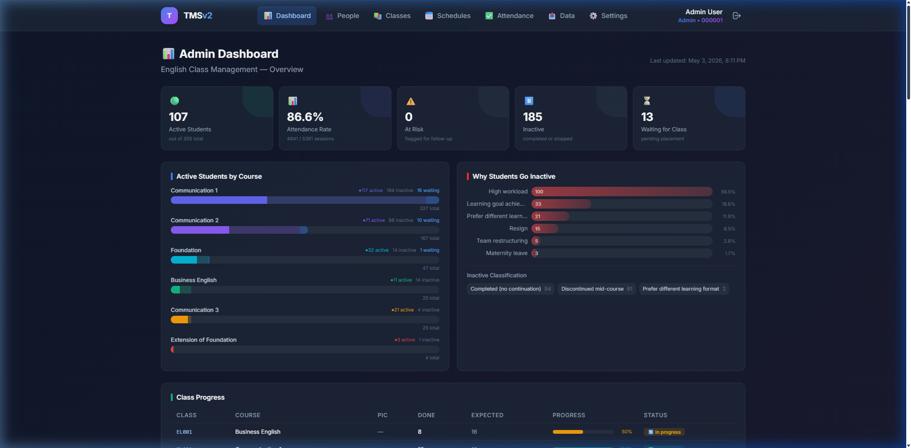
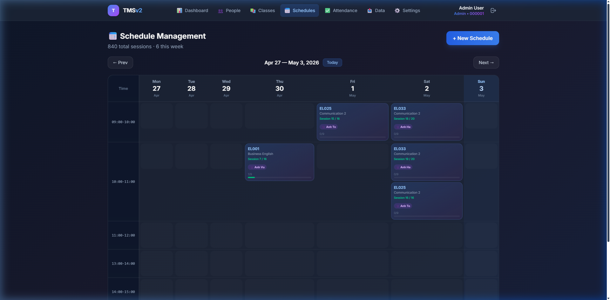
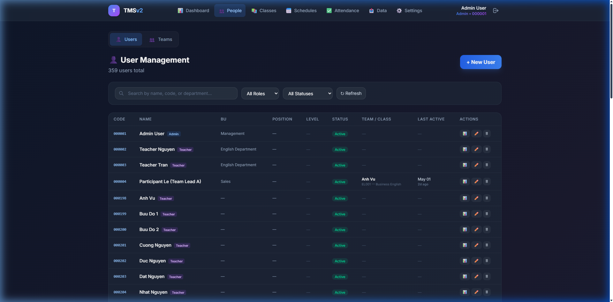
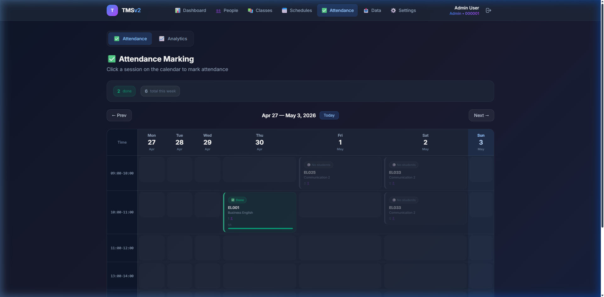

<p align="center">
  
  
  
  
  
</p>

<h1 align="center">📚 TMS v2 — Training Management System</h1>

<p align="center">
  <strong>A production-grade, full-stack web application for managing corporate English training programs.</strong><br/>
  Built with MongoDB · Express · React · Node.js
</p>

<p align="center">
  <a href="#-features">Features</a> •
  <a href="#-screenshots">Screenshots</a> •
  <a href="#%EF%B8%8F-architecture">Architecture</a> •
  <a href="#-quick-start">Quick Start</a> •
  <a href="#-api-reference">API</a> •
  <a href="#-deployment">Deployment</a>
</p>

---

## 🎯 Overview

TMS v2 replaces manual Excel-based processes with a centralized platform that automates **class scheduling**, **team-based slot booking**, **attendance tracking**, and **performance analytics** for corporate English training programs.

The system manages **300+ employees** across multiple departments, supports **role-based access control** for Admins, Teachers, Team Leaders, and Participants, and provides real-time dashboards with actionable insights.

### Key Highlights

| Metric | Before (Manual/Excel) | After (TMS v2) |
|:---|:---|:---|
| **Data Sync** | Manual entry, risk of password resets | 1-click Excel import with Upsert — passwords preserved |
| **Schedule Booking** | Email/chat coordination with Admin | Self-service Grid UI — Team Leaders book directly |
| **Conflict Resolution** | Frequent overbooking, no enforcement | ACID transactions — zero overbooking guarantee |
| **Attendance Reports** | Manual VLOOKUP at month-end | Real-time dashboards by Employee, Team, and Class |

---

## ✨ Features

### 👑 Admin
- **Dashboard** — KPI overview: active students, attendance rate, at-risk students, class progress
- **User Management** — CRUD, role assignment, status lifecycle (Active → On-hold → Dropped)
- **Team Management** — Create teams, assign leaders, manage members with cascade sync
- **Class Management** — Create courses, assign teachers, track session progress
- **Schedule Management** — Weekly calendar grid, create/edit sessions, manage bookings
- **Excel Import/Sync** — Bulk upsert employees and classes from Excel with smart conflict resolution
- **Google Sheets Sync** — Pull registrations from a shared Google Sheet
- **Data Export** — Export attendance reports to Excel for HR

### 👔 Team Leader (Participant)
- **Book Class** — Interactive weekly calendar to browse and book available slots
- **Team Dashboard** — View team schedule, member attendance, and upcoming sessions
- **Auto-enforcement** — Maximum 2 sessions/week/team, 1 team per slot

### 👨‍🏫 Teacher
- **Attendance Marking** — Calendar view with click-to-mark attendance (P/A/L/EL)
- **Student Evaluations** — Score grammar, vocabulary, pronunciation, fluency per student
- **Class Overview** — View enrolled students and session history

### 🔒 Security & Data Integrity
- JWT authentication with HttpOnly cookies
- Role-based access control (RBAC) with middleware guards
- MongoDB transactions for atomic booking operations
- Zod schema validation on all API inputs
- Helmet security headers, CORS allowlist, rate limiting
- NoSQL injection prevention via `express-mongo-sanitize`

---

## 📸 Screenshots

<details>
<summary><strong>🔐 Login Page</strong></summary>
<br/>

</details>

<details>
<summary><strong>📊 Admin Dashboard</strong></summary>
<br/>

</details>

<details open>
<summary><strong>📅 Schedule Management (Weekly Calendar Grid)</strong></summary>
<br/>

</details>

<details>
<summary><strong>👥 People Management</strong></summary>
<br/>

</details>

<details>
<summary><strong>✅ Attendance Tracking</strong></summary>
<br/>

</details>

---

## 🏗️ Architecture

```
tms-v2/
├── client/                    # React 19 + Vite frontend
│   ├── src/
│   │   ├── api/               # Axios API client layer
│   │   ├── components/        # Reusable UI components
│   │   ├── context/           # Auth context (React Context API)
│   │   ├── hooks/             # Custom React hooks
│   │   ├── pages/             # Route-level page components
│   │   └── App.jsx            # Router + Layout setup
│   └── vite.config.js
│
├── server/                    # Express.js REST API
│   ├── config/                # Database connection (resilient retry)
│   ├── controllers/           # Route handlers (14 controllers)
│   ├── helpers/               # Utility functions (pagination, dayjs, etc.)
│   ├── middleware/             # Auth, RBAC, rate limiting, validation, cache
│   ├── models/                # Mongoose schemas (9 models)
│   ├── routes/                # Express route definitions (13 route files)
│   ├── schemas/               # Zod validation schemas
│   ├── services/              # Business logic layer
│   ├── tests/                 # Unit + integration tests (Jest + Supertest)
│   └── server.js              # Entry point
│
├── docs/                      # Documentation & screenshots
├── package.json               # Monorepo orchestration scripts
└── render.yaml                # Render.com deployment blueprint
```

### Data Models

```mermaid
erDiagram
    USER ||--o{ TEAM : "belongs to"
    USER ||--o{ ATTENDANCE : "has"
    USER ||--o{ EVALUATION : "receives"
    USER ||--o{ ENROLLMENT : "enrolled in"
    TEAM ||--o{ SCHEDULE : "books"
    CLASS ||--o{ SCHEDULE : "has sessions"
    CLASS ||--o{ EVALUATION : "evaluated in"
    SCHEDULE ||--o{ ATTENDANCE : "tracked per"
    SCHEDULE ||--o{ ENROLLMENT : "contains"

    USER {
        string empCode PK
        string name
        string role "Admin | Teacher | Participant"
        string status "Active | On-hold | Dropped"
        string department
        string password "bcrypt hashed"
    }

    TEAM {
        string name
        ref leaderId FK
        ref[] members FK
    }

    CLASS {
        string classCode PK
        string course
        string status "Ongoing | Completed | Cancelled"
        ref teacherId FK
        int totalSessions
    }

    SCHEDULE {
        ref classId FK
        date date
        string timeSlot
        ref bookedTeamId FK
        int enrolledCount
    }
```

### Core Architectural Decisions

| Decision | Why |
|:---|:---|
| **`bulkWrite` + Upsert** | Import 10,000+ records in a single DB operation. Smart password preservation on updates. |
| **MongoDB Transactions** | Atomic slot booking — prevents race conditions when two Team Leaders book the same slot simultaneously. |
| **UTC Timezone Normalization** | All dates stored/computed in UTC via `dayjs`. Eliminates timezone-related display bugs across browsers/servers. |
| **Analytics Cache Layer** | In-memory cache (`node-cache`) for dashboard aggregations — reduces redundant DB queries. |
| **Auto-Release Hooks** | When a user is marked "Dropped" or a team is deleted, all future enrollments are automatically cleaned up. |

---

## 🚀 Quick Start

### Prerequisites

- **Node.js** ≥ 18.0.0
- **MongoDB** — [MongoDB Atlas](https://www.mongodb.com/atlas) (free tier) or local instance
- **Git**

### 1. Clone the Repository

```bash
git clone https://github.com/your-username/tms-v2.git
cd tms-v2
```

### 2. Configure Environment Variables

Create `server/.env`:

```env
# Required
MONGO_URI=mongodb+srv://<user>:<password>@cluster.mongodb.net/tms_v2
JWT_SECRET=your-super-secret-key-here

# Optional
PORT=5000
NODE_ENV=development
CORS_ORIGINS=http://localhost:5173,http://localhost:3000

# Google Sheets Sync (optional)
GOOGLE_SERVICE_ACCOUNT_KEY=./path-to-service-account.json
```

### 3. Install Dependencies & Seed Data

```bash
# Install all dependencies (server + client)
npm run install:server
npm run install:client

# Seed the database with demo data
npm run seed
```

### 4. Start Development Servers

```bash
# Terminal 1 — API Server (port 5000)
npm run dev:server

# Terminal 2 — React Dev Server (port 5173)
npm run dev:client
```

Open [http://localhost:5173](http://localhost:5173) and sign in with a test account:

| Employee Code | Password | Role |
|:---|:---|:---|
| `ADMIN001` | `admin12345` | Admin |
| `TEACH001` | `teacher123` | Teacher |
| `PART001` | `participant123` | Participant (Team Leader) |

---

## 📡 API Reference

Base URL: `http://localhost:5000/api`

All endpoints return JSON in the format:
```json
{ "success": true, "data": { ... } }
```

### Authentication

| Method | Endpoint | Description |
|:---|:---|:---|
| `POST` | `/api/auth/login` | Login → returns JWT token |
| `GET` | `/api/auth/me` | Get current user profile |

### Core Resources

| Resource | Endpoints | Auth |
|:---|:---|:---|
| **Users** | `GET/POST/PUT/DELETE` `/api/users` | Admin |
| **Teams** | `GET/POST/PUT/DELETE` `/api/teams` | Admin |
| **Classes** | `GET/POST/PUT/DELETE` `/api/classes` | Admin (write), Any (read) |
| **Schedules** | `GET/POST/PUT/DELETE` `/api/schedules` | Admin (write), Any (read) |
| **Attendance** | `POST` `/api/attendance/:scheduleId` | Teacher, Admin |
| **Evaluations** | `POST/GET/DELETE` `/api/evaluations` | Teacher (write), Any (read) |

### Booking & Enrollment

| Method | Endpoint | Description |
|:---|:---|:---|
| `POST` | `/api/schedules/:id/book-team` | Book a team into a slot |
| `POST` | `/api/schedules/:id/cancel-team` | Cancel a team's booking |
| `GET/POST` | `/api/enrollments` | Manage individual enrollments |

### Data Operations

| Method | Endpoint | Description |
|:---|:---|:---|
| `POST` | `/api/sync/google-sheets` | Sync from Google Sheets |
| `POST` | `/api/import/users` | Bulk import users from Excel |
| `POST` | `/api/import/classes` | Bulk import classes |
| `GET` | `/api/export/attendance` | Export attendance to Excel |
| `GET` | `/api/dashboard` | Aggregated analytics data |

> 📖 Full API documentation with request/response examples is available in [`server/API_REFERENCE.md`](server/API_REFERENCE.md)
>
> 📬 A Postman collection is included at [`server/TMS_v2_API.postman_collection.json`](server/TMS_v2_API.postman_collection.json)

---

## 🧪 Testing

```bash
cd server

# Run all tests (unit + integration)
npm test

# Tests use mongodb-memory-server — no external DB required
```

**Test coverage includes:**
- Authentication & authorization flows
- Booking concurrency & conflict resolution
- Attendance CRUD operations
- Team cascade delete behavior
- Input validation (Zod schemas)

---

## 🌐 Deployment

### Render.com (Recommended)

A `render.yaml` blueprint is included for one-click deployment:

1. Push your code to GitHub
2. Go to [Render Dashboard](https://render.com) → **New** → **Blueprint**
3. Connect your repository
4. Set environment variables in the Render dashboard:
   - `MONGO_URI` — Your MongoDB Atlas connection string
   - `CORS_ORIGINS` — Your Render app URL (e.g., `https://tms-v2.onrender.com`)
5. Deploy 🚀

The build pipeline runs:
```
npm run build
  → npm install (server)
  → npm install (client)
  → vite build (client → dist/)

npm start
  → node server.js (serves API + static React build)
```

### Manual Deployment

```bash
# Build for production
npm run build

# Start production server
NODE_ENV=production npm start
```

In production, Express serves the compiled React app from `client/dist/` and handles SPA routing.

---

## 🛠️ Tech Stack

### Frontend
| Technology | Purpose |
|:---|:---|
| [React 19](https://react.dev) | UI framework |
| [Vite 8](https://vite.dev) | Build tool & dev server |
| [React Router 7](https://reactrouter.com) | Client-side routing |
| [TanStack Query 5](https://tanstack.com/query) | Server state management & caching |
| [Tailwind CSS 4](https://tailwindcss.com) | Utility-first styling |
| [React Hot Toast](https://react-hot-toast.com) | Toast notifications |
| [Axios](https://axios-http.com) | HTTP client |

### Backend
| Technology | Purpose |
|:---|:---|
| [Express 4](https://expressjs.com) | Web framework |
| [Mongoose 8](https://mongoosejs.com) | MongoDB ODM |
| [JSON Web Tokens](https://jwt.io) | Authentication |
| [Zod 4](https://zod.dev) | Schema validation |
| [bcryptjs](https://github.com/dcodeIO/bcrypt.js) | Password hashing |
| [Helmet](https://helmetjs.github.io) | Security headers |
| [ExcelJS](https://github.com/exceljs/exceljs) | Excel import/export |
| [Day.js](https://day.js.org) | Date manipulation (UTC-normalized) |
| [Google APIs](https://googleapis.dev) | Google Sheets integration |

### DevOps & Testing
| Technology | Purpose |
|:---|:---|
| [Jest 30](https://jestjs.io) | Test runner |
| [Supertest](https://github.com/ladjs/supertest) | HTTP assertion library |
| [mongodb-memory-server](https://github.com/nodkz/mongodb-memory-server) | In-memory MongoDB for tests |
| [Render.com](https://render.com) | Cloud deployment platform |

---

## 📁 Environment Variables

| Variable | Required | Description |
|:---|:---|:---|
| `MONGO_URI` | ✅ | MongoDB connection string |
| `JWT_SECRET` | ✅ | Secret key for signing JWT tokens |
| `PORT` | ❌ | API server port (default: `5000`) |
| `NODE_ENV` | ❌ | `development` / `production` / `test` |
| `CORS_ORIGINS` | ❌ | Comma-separated allowed origins |
| `GOOGLE_SERVICE_ACCOUNT_KEY` | ❌ | Path to Google Cloud service account JSON |

---

## 📄 License

This project is licensed under the [MIT License](LICENSE).

---

<p align="center">
  Built with ❤️ using the MERN Stack
</p>
