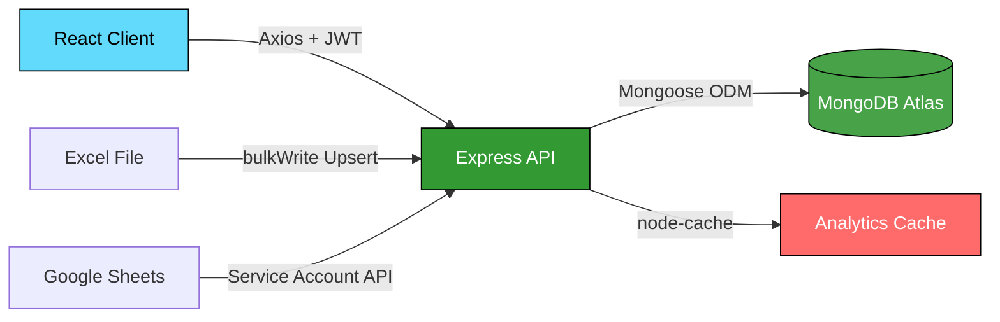

<p align="center">
  
  
  
  
  
</p>

<h1 align="center">🎓 Training Management System v2</h1>

<p align="center">
  <b>Hệ thống Quản lý Đào tạo Tiếng Anh doanh nghiệp — Full-stack MERN Application</b>
  <br/>
  <i>Quản lý lớp học, xếp lịch tự động, điểm danh real-time & báo cáo analytics</i>
</p>

<p align="center">
  <a href="#-tính-năng-chính">Tính năng</a> •
  <a href="#-screenshots">Screenshots</a> •
  <a href="#%EF%B8%8F-kiến-trúc-hệ-thống">Kiến trúc</a> •
  <a href="#-cài-đặt--chạy-local">Cài đặt</a> •
  <a href="#-api-reference">API</a> •
  <a href="#-deployment">Deploy</a>
</p>

---

## 📋 Tổng quan

**TMS v2** là hệ thống quản lý đào tạo tiếng Anh nội bộ doanh nghiệp, được xây dựng trên nền tảng **MERN Stack** (MongoDB, Express, React, Node.js). Hệ thống thay thế hoàn toàn quy trình quản lý thủ công bằng Excel, giải quyết các bài toán về:

- 🔄 **Đồng bộ dữ liệu nhân sự** từ hệ thống HR qua Excel import (Upsert — không reset mật khẩu)
- 📅 **Xếp lịch tự động** với cơ chế chống xung đột (MongoDB Transaction)
- ✅ **Điểm danh real-time** với Dashboard phân tích theo Cá nhân / Team / Lớp
- 👥 **Phân quyền 3 cấp:** Admin, Teacher, Participant (Team Leader)

---

## ✨ Tính năng chính

### 🔐 Xác thực & Phân quyền
- Đăng nhập bằng **Employee Code** (mã nhân viên)
- JWT token (HttpOnly cookie) với cơ chế auto-expire
- 3 vai trò: **Admin** (toàn quyền), **Teacher** (điểm danh), **Participant** (xem lịch & đặt slot)
- Rate limiting & NoSQL injection prevention

### 📊 Dashboard Analytics
- Tổng quan KPI: Active Students, Attendance Rate, At Risk, Inactive
- Biểu đồ **Active Students by Course** (stacked bar)
- Phân tích **Why Students Go Inactive** (nguyên nhân nghỉ học)
- Bảng **Class Progress** theo tiến độ từng lớp

### 📅 Quản lý Lịch học (Schedule Grid)
- Giao diện **Weekly Grid** (Ma trận Tuần) — trục ngang: ngày, trục dọc: khung giờ
- **1 Slot = 1 Team** — chống đặt trùng bằng MongoDB Transaction
- Giới hạn tối đa **2 buổi/tuần/team** (business rule)
- Auto-release slot khi team bị xóa thành viên

### ✅ Điểm danh
- Giao diện lịch tuần cho Teacher chọn session điểm danh
- Trạng thái: **P** (Present), **A** (Absent), **L** (Late), **EL** (Excused Leave)
- Bulk upsert — có thể chỉnh sửa nhiều lần không tạo duplicate
- Tự động loại nhân sự đã nghỉ (Dropped) khỏi danh sách

### 👥 Quản lý Nhân sự & Team
- CRUD Users với filter theo Role / Status / Department
- Quản lý Teams: Leader assignment, member management
- **Auto-Release Middleware:** Khi user chuyển status → Dropped, tự động gỡ khỏi tất cả lịch học tương lai
- **Cascade Sync:** Thay đổi member trong team → tự động đồng bộ enrollment

### 📤 Import / Export & Đồng bộ
- **Excel Import** (Upsert): Import hàng nghìn nhân sự qua `bulkWrite` — giữ nguyên mật khẩu cũ
- **Google Sheets Sync**: Kéo dữ liệu đăng ký từ Master Sheet
- **HR Export**: Xuất báo cáo chuyên cần ra Excel

---

## 📸 Screenshots

<p align="center">
  
  <br/><em>Trang đăng nhập — Dark theme với glassmorphism</em>
</p>

<p align="center">
  
  <br/><em>Admin Dashboard — KPI cards, biểu đồ phân tích & bảng tiến độ lớp</em>
</p>

<p align="center">
  
  <br/><em>Schedule Grid — Ma trận lịch học tuần với time slots</em>
</p>

<p align="center">
  
  <br/><em>Attendance — Lịch tuần cho Teacher điểm danh theo session</em>
</p>

---

## 🏗️ Kiến trúc hệ thống

```
tms-v2/                         # Monorepo root
├── client/                     # Frontend — React + Vite + TailwindCSS
│   ├── src/
│   │   ├── api/                #   Axios instances & API hooks
│   │   ├── components/         #   Shared UI components (Navbar, Layout, ErrorBoundary)
│   │   ├── context/            #   AuthContext (JWT state management)
│   │   ├── hooks/              #   Custom React hooks
│   │   ├── pages/              #   18 page components
│   │   │   ├── DashboardPage       # Admin analytics dashboard
│   │   │   ├── SchedulesPage       # Weekly grid CRUD (Admin/Teacher)
│   │   │   ├── BookClassPage       # Booking UI (Participant)
│   │   │   ├── AttendancePage      # Bulk attendance marking
│   │   │   ├── UsersPage           # User management
│   │   │   ├── TeamsPage           # Team management
│   │   │   ├── ClassesPage         # Class management
│   │   │   ├── SyncPage            # Excel/Google Sheets import
│   │   │   └── ...
│   │   └── App.jsx             #   Route definitions & role guards
│   └── vite.config.js
│
├── server/                     # Backend — Express + Mongoose
│   ├── config/                 #   Database connection
│   ├── controllers/            #   14 controllers (route handlers)
│   ├── middleware/              
│   │   ├── auth.js             #     JWT verification & token-invalidation check
│   │   ├── roleGuard.js        #     Role-based access control
│   │   ├── rateLimiters.js     #     Tiered rate limiting (auth/api/import)
│   │   ├── validate.js         #     Zod schema validation
│   │   └── analyticsCache.js   #     In-memory cache layer (node-cache)
│   ├── models/                 #   9 Mongoose models
│   │   ├── User.js             #     Auto-Release middleware (Dropped → remove from schedules)
│   │   ├── Schedule.js         #     Collision detection indexes
│   │   ├── Team.js             #     Cascade sync hooks
│   │   ├── Attendance.js       #     Compound unique index (scheduleId + userId)
│   │   └── ...
│   ├── services/               #   Business logic (booking, attendance, import/export)
│   ├── schemas/                #   Zod validation schemas (9 files)
│   ├── helpers/                #   Shared utilities (dayjs UTC, pagination, counter)
│   ├── routes/                 #   13 route files
│   ├── tests/                  #   Unit & Integration tests (Jest + Supertest)
│   ├── server.js               #   Express app entry point
│   └── seed.js                 #   Database seeder
│
├── package.json                # Root monorepo scripts
├── render.yaml                 # Render.com deployment blueprint
└── docs/
    └── screenshots/
```

### Data Flow Architecture



### Core Business Rules

| Rule | Implementation |
|:-----|:---------------|
| **1 Slot = 1 Team** | MongoDB Transaction với collision-check query |
| **Max 2 sessions/week/team** | Atomic count trong cùng transaction |
| **Auto-Release on Drop** | Mongoose `post('findOneAndUpdate')` hook trên User model |
| **Team Sync** | Cascade middleware trên Team model → sync `enrolledUsers` |
| **UTC Normalization** | `dayjs.utc()` + `startOf('isoWeek')` cho mọi tính toán tuần |
| **Password-safe Import** | Upsert chỉ hash password khi `isNew === true` |

---

## 🛡️ Security

| Layer | Measure |
|:------|:--------|
| **Headers** | Helmet CSP, HSTS, X-Frame-Options |
| **Auth** | JWT (HttpOnly cookie), `passwordChangedAt` invalidation |
| **Input** | Zod schema validation, `express-mongo-sanitize` |
| **Rate Limit** | Tiered: Auth (5/15m), API (100/15m), Import (3/15m) |
| **CORS** | Whitelist-based origin validation |
| **Passwords** | bcrypt (12 rounds), min 10 chars, `select: false` |

---

## 🚀 Cài đặt & Chạy local

### Yêu cầu
- **Node.js** ≥ 18.0
- **MongoDB** (local hoặc [MongoDB Atlas](https://cloud.mongodb.com))
- **Git**

### 1. Clone repository

```bash
git clone https://github.com/<your-username>/tms-v2.git
cd tms-v2
```

### 2. Cấu hình Environment

Tạo file `server/.env`:

```env
PORT=5000
NODE_ENV=development
MONGO_URI=mongodb+srv://<user>:<password>@cluster.mongodb.net/tms-v2
JWT_SECRET=your-super-secret-key-at-least-32-chars
CORS_ORIGINS=http://localhost:5173

# Optional: Google Sheets Sync
GOOGLE_SERVICE_ACCOUNT_KEY=./path-to-key.json
```

### 3. Cài đặt dependencies

```bash
# Cài đặt toàn bộ (root + server + client)
npm run build

# Hoặc cài riêng từng phần
npm run install:server
npm run install:client
```

### 4. Seed dữ liệu mẫu

```bash
npm run seed
```

Tạo sẵn các tài khoản test:

| Employee Code | Password | Role |
|:---:|:---:|:---:|
| `ADMIN001` | `admin12345` | Admin |
| `TEACH001` | `teacher123` | Teacher |
| `PART001` | `participant123` | Participant |

### 5. Chạy Development

```bash
# Terminal 1 — Backend (port 5000, auto-reload)
npm run dev:server

# Terminal 2 — Frontend (port 5173, HMR)
npm run dev:client
```

Mở trình duyệt: **http://localhost:5173**

---

## 📡 API Reference

Base URL: `http://localhost:5000/api`

### Authentication
| Method | Endpoint | Auth | Description |
|:-------|:---------|:-----|:------------|
| `POST` | `/auth/login` | — | Đăng nhập (empCode + password) |
| `GET` | `/auth/me` | Bearer | Lấy thông tin user hiện tại |

### Users (Admin)
| Method | Endpoint | Description |
|:-------|:---------|:------------|
| `GET` | `/users` | Danh sách users (filter: role, status, department) |
| `POST` | `/users` | Tạo user mới |
| `PUT` | `/users/:id` | Cập nhật user (auto-release nếu → Dropped) |
| `DELETE` | `/users/:id` | Xóa user |

### Teams (Admin)
| Method | Endpoint | Description |
|:-------|:---------|:------------|
| `GET` | `/teams` | Danh sách teams (populated members) |
| `POST` | `/teams` | Tạo team |
| `PUT` | `/teams/:id` | Cập nhật team (cascade sync schedules) |
| `DELETE` | `/teams/:id` | Xóa team |

### Classes
| Method | Endpoint | Description |
|:-------|:---------|:------------|
| `GET` | `/classes` | Danh sách lớp học |
| `POST` | `/classes` | Tạo lớp (Admin) |
| `GET` | `/classes/:id` | Chi tiết lớp |

### Schedules
| Method | Endpoint | Description |
|:-------|:---------|:------------|
| `GET` | `/schedules` | Lịch học (filter: classId, from, to) |
| `POST` | `/schedules` | Tạo session mới |
| `POST` | `/schedules/:id/book-team` | Đặt slot cho team |
| `POST` | `/schedules/:id/cancel-team` | Hủy booking |

### Attendance
| Method | Endpoint | Description |
|:-------|:---------|:------------|
| `POST` | `/attendance/:scheduleId` | Bulk điểm danh (upsert) |
| `GET` | `/attendance/schedule/:scheduleId` | Lấy điểm danh theo session |
| `GET` | `/attendance/user/:userId` | Lịch sử điểm danh cá nhân |

### Evaluations
| Method | Endpoint | Description |
|:-------|:---------|:------------|
| `POST` | `/evaluations` | Tạo/cập nhật đánh giá |
| `GET` | `/evaluations` | Danh sách (filter: classId, userId) |

### Data Sync (Admin)
| Method | Endpoint | Description |
|:-------|:---------|:------------|
| `POST` | `/import/users` | Import users từ Excel (upsert) |
| `POST` | `/sync/google-sheets` | Sync từ Google Sheets |
| `GET` | `/export/hr-report` | Xuất báo cáo HR |
| `GET` | `/dashboard/stats` | Dashboard analytics |

> 📖 Xem chi tiết đầy đủ tại [API_REFERENCE.md](server/API_REFERENCE.md) hoặc import file [Postman Collection](server/TMS_v2_API.postman_collection.json).

---

## ☁️ Deployment

### Deploy lên Render.com (1-click)

Dự án đã có sẵn `render.yaml` blueprint:

1. Truy cập [render.com/deploy](https://render.com/deploy)
2. Kết nối GitHub repo
3. Cấu hình Environment Variables:
   - `MONGO_URI` — MongoDB Atlas connection string
   - `JWT_SECRET` — Auto-generated
   - `CORS_ORIGINS` — URL Render (vd: `https://tms-v2.onrender.com`)

```yaml
# render.yaml
services:
  - type: web
    name: tms-v2
    runtime: node
    plan: free
    buildCommand: npm run build    # Install deps + build React
    startCommand: npm start        # Express serves static + API
```

### Production Build (Manual)

```bash
# Build client → server serves static files
npm run build
npm start
```

Express tự động serve React build từ `client/dist/` khi `NODE_ENV=production`.

---

## 🧪 Testing

```bash
cd server

# Chạy toàn bộ test suite
npm test

# Chạy E2E test
node e2e_test.js

# Stress test booking (concurrent)
node tests/stress_test_booking.js
```

Test stack: **Jest** + **Supertest** + **mongodb-memory-server**

---

## 🛠️ Tech Stack

### Frontend
| Technology | Purpose |
|:-----------|:--------|
| **React 19** | UI framework (SPA) |
| **Vite 8** | Build tool & dev server (HMR) |
| **TailwindCSS 4** | Utility-first CSS |
| **React Router 7** | Client-side routing |
| **TanStack Query 5** | Server state management & caching |
| **Axios** | HTTP client |
| **react-hot-toast** | Toast notifications |

### Backend
| Technology | Purpose |
|:-----------|:--------|
| **Node.js ≥18** | Runtime |
| **Express 4** | Web framework |
| **Mongoose 8** | MongoDB ODM |
| **Zod 4** | Schema validation |
| **JWT** | Authentication |
| **bcryptjs** | Password hashing |
| **Helmet** | Security headers |
| **dayjs** | Date/time (UTC normalization) |
| **ExcelJS** | Excel export |
| **Google APIs** | Google Sheets integration |
| **node-cache** | In-memory caching |

### DevOps & Testing
| Technology | Purpose |
|:-----------|:--------|
| **Jest 30** | Test runner |
| **Supertest** | HTTP integration testing |
| **mongodb-memory-server** | In-memory MongoDB for tests |
| **Render.com** | Cloud hosting (IaC via `render.yaml`) |

---

## 📁 Cấu trúc dữ liệu (Models)

```mermaid
erDiagram
    User ||--o{ Attendance : "has"
    User ||--o{ Enrollment : "enrolled_in"
    User }o--|| Team : "member_of"
    Team ||--o{ Schedule : "books"
    Class ||--o{ Schedule : "has"
    Schedule ||--o{ Attendance : "records"
    Class ||--o{ Evaluation : "evaluates"
    User ||--o{ Evaluation : "receives"

    User {
        string empCode PK
        string name
        string role
        string department
        string status
        string entranceLevel
        string currentLevel
    }

    Team {
        string name
        ObjectId leaderId FK
        ObjectId[] members
    }

    Class {
        string classCode PK
        string name
        string course
        string status
    }

    Schedule {
        ObjectId classId FK
        ObjectId bookedTeamId FK
        Date startTime
        Date endTime
        int capacity
        ObjectId[] enrolledUsers
    }

    Attendance {
        ObjectId scheduleId FK
        ObjectId userId FK
        string status
        string remark
    }
```

---

## 🤝 Đóng góp

1. Fork repository
2. Tạo branch: `git checkout -b feature/ten-tinh-nang`
3. Commit: `git commit -m "feat: mô tả tính năng"`
4. Push: `git push origin feature/ten-tinh-nang`
5. Tạo Pull Request

---

## 📄 License

Distributed under the **MIT License**. See `LICENSE` for more information.

---

<p align="center">
  Made with ❤️ by <b>TMS Development Team</b>
  <br/>
  <sub>Training Management System v2.0.0</sub>
</p>
