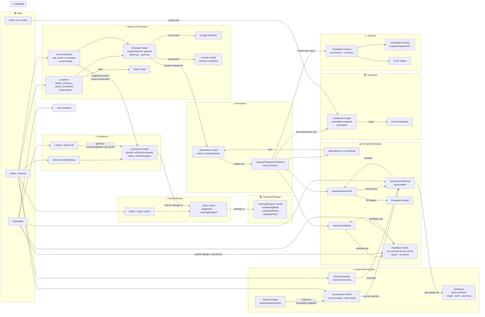
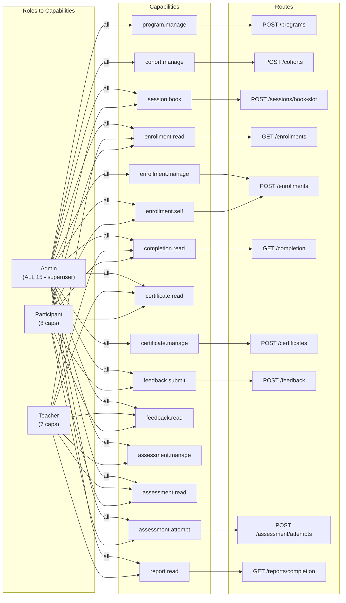

# ConCho2 LMS — Architecture & Function Map

> **Auto-generated:** 2026-06-03 — maps all built functions and their connections.

---

## 1. High-Level System Architecture

```mermaid
graph TB
    subgraph "🌐 Client (React/Vite)"
        UI[LearningPage<br/>Programs · Cohorts · Assessments<br/>Feedback · Reports]
        ME["/me/* (Participant self-service)<br/>Assessments · Feedback"]
        LEGACY[Legacy Pages<br/>Classes · Attendance · Schedule<br/>People · Dashboard · Settings]
        AUTH_UI[Auth Pages<br/>Login · MFA · Force Password]
    end

    subgraph "🔒 Middleware Stack"
        AUTH_MW[JWT Auth<br/>cookie + Bearer<br/>JTI revocation · MFA gate]
        CAP[Capability Authz<br/>15 capabilities<br/>Admin superuser]
        RATE[Rate Limiters<br/>auth · booking · export]
        VAL[Zod Validation]
        CSRF[CSRF Protection]
        SANITIZE[Mongo Sanitize]
        HELMET[Helmet CSP]
        LOG[pino-http + requestId]
        SENTRY[Sentry Error Tracking]
    end

    subgraph "⚙️ Backend (Express + MongoDB)"
        subgraph "domains/learning/"
            PROG[Program CRUD]
            COHORT[Cohort CRUD]
            SESSION[Session Booking<br/>4 scheduling modes]
            ENROLL[Enrollment<br/>admin + self-enroll]
            COMPLETION[Completion Engine<br/>attendance · assessment · feedback]
            CERT[Certificates<br/>issue · revoke · verify]
            FEEDBACK_MOD[Feedback Module<br/>submit · list]
            REPORTS[Reports<br/>completion + xlsx export]
        end
        subgraph "domains/assessment/"
            ASSESS[Assessment Engine<br/>author · attempt · auto-grade]
            QBANK[Question Bank<br/>reusable questions]
            MGRADE[Manual Grading<br/>short-text override]
        end
        subgraph "domains/schedule/"
            SCHED_ADAPTER[Schedule Adapter<br/>update · delete]
        end
        subgraph "Legacy Controllers"
            AUTH_CTRL[Auth + MFA]
            USER_CTRL[Users CRUD]
            TEAM_CTRL[Teams]
            CLASS_CTRL[Classes]
            ATTEND_CTRL[Attendance]
            EVAL_CTRL[Evaluation]
            EXPORT_CTRL[Export]
            RECONCILE[Reconcile]
            DASHBOARD[Dashboard]
        end
    end

    subgraph "💾 MongoDB"
        MODELS[(18 Models<br/>Schedule · Class · User · Team<br/>LearningProgram · Enrollment<br/>Assessment · AssessmentAttempt<br/>AssessmentQuestion · Attendance<br/>Certificate · Feedback · Evaluation<br/>AuditLog · Counter · TokenBlocklist<br/>Setting · ReconcileReport)]
    end

    subgraph "🔗 External Services"
        GCal[Google Calendar]
        SMTP[SMTP Email]
        GSheets[Google Sheets]
        CRON[Cron Jobs<br/>reconcile]
    end

    UI --> AUTH_MW --> CAP --> VAL --> PROG & COHORT & SESSION & ENROLL & COMPLETION & CERT & FEEDBACK_MOD & REPORTS
    ME --> AUTH_MW --> ASSESS & FEEDBACK_MOD
    LEGACY --> AUTH_MW --> AUTH_CTRL & USER_CTRL & TEAM_CTRL & CLASS_CTRL & ATTEND_CTRL & EVAL_CTRL & EXPORT_CTRL & DASHBOARD
    PROG & COHORT & SESSION & ENROLL & COMPLETION & CERT & FEEDBACK_MOD & REPORTS & ASSESS & QBANK & MGRADE --> MODELS
    SESSION --> GCal
    SESSION --> SCHED_ADAPTER
    CERT --> SMTP
    RECONCILE --> CRON
    EXPORT_CTRL --> GSheets
    SENTRY -.-> |errors| LOG
```



---

## 2. Backend Domain Data Flow — How Functions Connect



---

## 3. Frontend Pages & Feature Map

```mermaid
graph TB
    subgraph "🔓 Auth Flow"
        LOGIN["/login<br/>LoginPage"]
        MFA["MFA verification"]
        FORCE_PW["Force password change"]
        LOGIN --> MFA --> FORCE_PW
    end

    subgraph "🏠 Dashboard"
        DASH["/dashboard<br/>Role-based home"]
        DASH -->|"Admin/Teacher"| LEARNING_LINK["→ /learning"]
        DASH -->|"Participant"| ME_ASSESS_LINK["→ /me/assessments"]
        DASH -->|"Participant"| ME_FEED_LINK["→ /me/feedback"]
    end

    subgraph "📚 /learning (Admin/Teacher)"
        LP_PAGE["LearningPage.jsx<br/>(tab container)"]
        
        subgraph "Programs Tab"
            PROG_TAB["ProgramsTab"]
            PROG_MODAL["ProgramFormModal<br/>create · edit"]
            PROG_TAB --> PROG_MODAL
        end
        
        subgraph "Cohorts Tab"
            COHORT_TAB["CohortsTab"]
            COHORT_MODAL["CohortFormModal<br/>create"]
            ENROLL_MODAL["EnrollLearnersModal<br/>enroll · withdraw"]
            COHORT_TAB --> COHORT_MODAL
            COHORT_TAB --> ENROLL_MODAL
        end
        
        subgraph "Assessments Tab"
            ASSESS_TAB["AssessmentsTab"]
            ASSESS_FORM["AssessmentFormModal<br/>create · edit"]
            QB_PANEL["QuestionBankPanel"]
            QB_FORM["QuestionBankFormModal"]
            QB_IMPORT["QuestionBankImportPicker"]
            REVIEW_MODAL["ManualGradingModal<br/>review attempts"]
            ASSESS_TAB --> ASSESS_FORM
            ASSESS_TAB --> QB_PANEL
            QB_PANEL --> QB_FORM
            ASSESS_FORM --> QB_IMPORT
            ASSESS_TAB --> REVIEW_MODAL
        end
        
        subgraph "Feedback Tab"
            FB_TAB["FeedbackTab<br/>view submissions per cohort"]
        end
        
        subgraph "Reports Tab"
            RPT_TAB["ReportsTab"]
            RPT_TABLE["CompletionReportTable"]
            ROLLUP_TABLE["CompletionRollupTable"]
            RPT_TAB --> RPT_TABLE
            RPT_TAB --> ROLLUP_TABLE
            RPT_TAB -->|"xlsx download"| XLSX_BTN["Export button"]
        end
        
        LP_PAGE --> PROG_TAB & COHORT_TAB & ASSESS_TAB & FB_TAB & RPT_TAB
    end

    subgraph "👤 /me/* (Participant)"
        ME_ASSESS["/me/assessments<br/>list published quizzes<br/>take attempt"]
        ME_ASSESS_DIALOG["AssessmentAttemptModal<br/>answer questions"]
        ME_FEED["/me/feedback<br/>submit ratings"]
        ME_FEED_FORM["FeedbackFormModal"]
        
        ME_ASSESS --> ME_ASSESS_DIALOG
        ME_FEED --> ME_FEED_FORM
    end

    subgraph "📋 Legacy Pages"
        CLASSES["ClassesPage<br/>(cohort edit/delete still here)"]
        CLASS_DETAIL["ClassDetailPage<br/>breadcrumb: Programs→Learning"]
        SCHEDULE["SchedulePage<br/>calendar booking"]
        ATTEND["AttendancePage"]
        PEOPLE["PeoplePage"]
        SETTINGS["SettingsPage"]
        EXPORT["ExportPage"]
    end

    subgraph "🔗 Shared Infrastructure"
        API_CLIENT["api.js<br/>axios + interceptors"]
        LEARNING_API["learningAPI methods"]
        ASSESSMENT_API["assessmentAPI methods"]
        QUERY_KEYS["queryKeys.js"]
        USE_LEARNING["useLearning.js<br/>React Query hooks"]
        USE_ROLE["useRole hook<br/>permission gating"]
        I18N["i18n (en + vi)<br/>learning namespace"]
        
        API_CLIENT --> LEARNING_API & ASSESSMENT_API
        LEARNING_API --> USE_LEARNING
        ASSESSMENT_API --> USE_LEARNING
        USE_LEARNING --> QUERY_KEYS
        USE_ROLE -.-> |gates| LP_PAGE & ME_ASSESS & ME_FEED
        I18N -.-> |labels| LP_PAGE & ME_ASSESS & ME_FEED
    end

    DASH --> LP_PAGE
    LP_PAGE --> CLASS_DETAIL
```



---

## 4. Data Model Relationship Map

```mermaid
erDiagram
    User ||--o{ Enrollment : "enrolls in"
    User ||--o{ Attendance : "attends"
    User ||--o{ AssessmentAttempt : "submits"
    User ||--o{ Feedback : "gives"
    User ||--o{ Certificate : "receives"
    User ||--o{ Schedule : "books (leader)"
    
    LearningProgram ||--o{ Class : "has cohorts"
    LearningProgram {
        string schedulingMode
        string deliveryMode
        object completionPolicy
        object capacityPolicy
    }
    
    Class ||--o{ Enrollment : "has enrollments"
    Class ||--o{ Schedule : "has sessions"
    Class ||--o{ Assessment : "has assessments"
    Class }o--|| LearningProgram : "belongs to"
    
    Enrollment {
        ObjectId teamId "nullable for cohort-based"
        enum status "Active | Dropped"
    }
    
    Schedule ||--o{ Attendance : "tracked by"
    Schedule }o--o| Team : "bookedTeamId (optional)"
    Schedule {
        ObjectId bookedTeamId "nullable for cohort sessions"
        date startTime
        date endTime
    }
    
    Assessment ||--o{ AssessmentAttempt : "has attempts"
    Assessment ||--o{ AssessmentQuestion : "imports from bank"
    Assessment }o--|| Class : "cohort-scoped"
    
    AssessmentQuestion {
        string questionType
        array items "immutable bank items"
    }
    
    AssessmentAttempt {
        array answers
        number scorePercent
        boolean passed
        object manualGrading
    }
    
    Attendance {
        enum status "Present | Absent"
    }
    
    Feedback {
        number overallRating
        string comments
    }
    
    Certificate {
        string verificationCode
        string status "Active | Revoked"
        object snapshot "immutable"
    }
    
    Evaluation ||--o{ User : "legacy assessment"
```

---

## 5. Capability → Route Authorization Map



---

## How to View

- **GitHub / GitLab:** Mermaid renders natively in markdown preview
- **VS Code:** Install "Markdown Preview Mermaid Support" extension
- **Online:** Paste diagrams into [mermaid.live](https://mermaid.live)