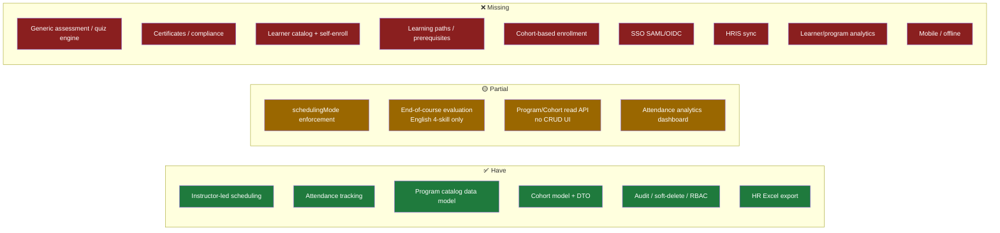
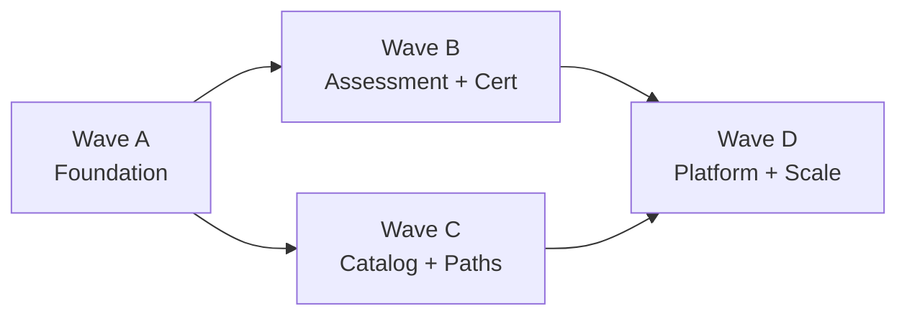

# LMS Roadmap — scaling TMS v2 into a comprehensive internal LMS

> **Read first:** [`system-overview.md`](system-overview.md) (where we are today).
> This doc answers: *what does a comprehensive internal LMS need, what's the gap,
> and what do we do — in what order — to get there?*

---

## 1. Vision & target

Build a **comprehensive internal enterprise LMS** for our own organization —
many program types, departments, and delivery modes — not a commercial product.

**In scope** (your priorities, in weight order):
1. **Assessment & certification** — quizzes/question banks, auto-grading,
   completion rules, certificates, compliance tracking.
2. **Catalog, learning paths & self-service** — learner-facing catalog,
   self-enroll, prerequisites/curricula.
3. **Platform & scale** — SSO (SAML/OIDC), HRIS sync, advanced analytics, mobile.

**De-scoped (for now):**
- SCORM/xAPI courseware authoring & video hosting → later option, not core yet.
- Multi-tenant / billing / white-label → not needed for an internal LMS.

---

## 2. Capability gap analysis

| Capability | LMS expectation | Current state in code | Gap / what to build |
|---|---|---|---|
| **Enrollment** | Learner enrolls into cohort/program directly | `Enrollment` is team-based (`userId`+`teamId`) | Cohort-based enrollment + `/api/learning/enrollments`; self-enroll |
| **Assessment** | Generic quizzes, question banks, auto-grade | `Evaluation` = fixed 4 English skills (0–10), manual | Generic **Assessment** domain (item types, scoring, attempts) |
| **Certification** | Issue/track certificates, expiry, compliance | none | Certificate model + completion → issue + verify |
| **Catalog (learner)** | Browse/search catalog, request/self-enroll | `LearningProgram` CRUD is **Admin read-only** | Learner-facing catalog page + self-enroll flow |
| **Learning paths** | Sequenced curricula, prerequisites | none | Path/curriculum model + prerequisite gating |
| **Completion** | Policy-driven completion (attendance %, assessment, feedback) | `completionPolicy` **stored, not enforced** | Completion engine reading the policy |
| **Scheduling modes** | leader / admin / self-enroll / nomination | `leader_booking` only; others gated 501 | Build the 3 remaining flows |
| **AuthN** | SSO (SAML/OIDC) for enterprise | password + TOTP MFA | Add SSO provider; keep MFA fallback |
| **People sync** | HRIS-driven user/department provisioning | manual Excel import | HRIS connector + scheduled sync |
| **Analytics** | Learner progress, program effectiveness | attendance-centric Admin dashboard | Learner/program analytics + completion metrics |
| **Authorization** | Capability-based (`program.manage`, `session.book`) | role-based (Admin/Teacher/Participant) | Role → capability layer (already intended) |
| **Mobile** | App or strong mobile UX/offline | responsive web only | PWA/offline or native (lowest priority) |

---

## 3. What to consider (strategic / architectural)

- **Finish the vocabulary generalization, don't restart it.** The migration
  already abstracts `Class→Cohort`, `courseName→Program` via DTOs. Continue:
  `Evaluation→Assessment`, team-based→cohort-based enrollment, `Team→LearningGroup`.
  Physical collection renames stay **out of scope** (ADR) — migrate via DTOs.
- **Policies are already modeled — enforce them.** `LearningProgram` carries
  `schedulingMode`, `deliveryMode`, `completionPolicy`, `capacityPolicy`,
  `facilitatorPolicy`. Today only `schedulingMode` is partly enforced. Each
  enforced policy unlocks an LMS behavior (self-paced, self-enroll, completion).
- **Role → capability authorization.** Hard-coded roles won't scale to many
  program types. Introduce capabilities behind the existing two-layer authz
  (`roleGuard` + `policy/`) so new flows don't multiply role checks.
- **MongoDB → PostgreSQL (Phase-6 gate).** Learning paths, prerequisites, and
  cross-program analytics are relational by nature. Decide at the gate, not now;
  trigger = when path/prerequisite + reporting queries get painful on Mongo.
- **Assessment: build vs buy.** A generic quiz/assessment engine is the biggest
  net-new domain. Decide early: build minimal in-house vs integrate an engine.
- **Integrations:** SSO (SAML/OIDC), HRIS sync, calendar/Zoom — design as a
  thin `domains/integrations` boundary, keep fail-soft like Google Calendar.
- **Infra/scale:** Render free-tier sleeps (cron needs external pinger);
  plan observability + a real scheduler before relying on completion/cert jobs.

---

## 4. Sequenced roadmap (waves)

Continues the handoff's Phase 1–6, extended toward LMS. Each wave: **goal ·
building blocks · code to extend**.

### Wave A — Foundation *(in progress = handoff P0/P1)*
- **Goal:** the generic learning core actually works end to end.
- Finish `schedulingMode` flows (admin_scheduled → self_enroll → nomination) —
  extend `server/domains/learning/session/use-cases.js` (501 stubs already there).
- **Cohort-based enrollment** + `/api/learning/enrollments` — new use-cases over
  `Enrollment`/`Class`.
- **Catalog & cohort CRUD UI** — extend `client/src/pages/LearningPage.jsx`
  (currently read-only) + `useLearning.js`.
- Begin **capability-based authz** scaffolding in `server/policy/`.

### Wave B — Assessment & certification *(your #1 priority)*
- **Goal:** measure learning, certify completion.
- New `domains/assessment` (generalize `Evaluation`): item types, question bank,
  attempts, auto-grading; keep the English 4-skill rubric as one assessment type.
- **Enforce `completionPolicy`** (attendance % + required assessment + feedback).
- **Certificate** model + issue-on-completion + verification endpoint.

### Wave C — Catalog, paths & self-service *(your #2 priority)*
- **Goal:** learners drive their own learning.
- Learner-facing **catalog** (browse/search) + **self-enroll** (uses Wave A
  enrollment + `self_enroll` scheduling mode).
- **Learning paths / curricula** with prerequisite gating (likely the trigger
  for the Postgres decision).

### Wave D — Platform & scale *(your #3 priority)*
- **Goal:** enterprise-grade plumbing.
- **SSO** (SAML/OIDC) alongside existing auth; **HRIS sync** for users/departments.
- **Analytics** beyond attendance: learner progress, program effectiveness,
  completion/compliance dashboards.
- **Mobile** (PWA/offline) — lowest priority.
- Evaluate **PostgreSQL** migration at the gate.

---

## 5. Immediate next 3 steps (this month)

From exactly where we are now (booking enforces `schedulingMode`, 3 modes gated):

1. **Build `admin_scheduled`** (most common next mode) — Admin creates a session
   for a cohort without team-leader booking. Replace its 501 in
   `domains/learning/session/use-cases.js`; needs a non-team creation path +
   schema tweak (`groupId` optional).
2. **Generalize enrollment** → `/api/learning/enrollments` (cohort-based,
   multi-program), foundation for self-enroll.
3. **Learning CRUD UI** — create/edit Program, create Cohort, enroll learners
   (today the page is read-only).

*(Matches handoff §4 P0. After these, Wave B assessment work begins.)*

---

## 6. Risks & decision gates

| Decision | When | Trade-off |
|---|---|---|
| Mongo vs PostgreSQL | Phase-6 gate (after paths/analytics pressure) | Relational fit vs migration cost; don't pre-migrate |
| Assessment: build vs buy | Start of Wave B | In-house control vs speed; minimal build likely first |
| SCORM/courseware scope | Wave C/D or defer | Big surface; de-scoped for now — revisit if self-paced content needed |
| How far to generalize | Continuous | Over-abstracting before need (YAGNI) vs legacy lock-in |
| Capability vs role authz | Wave A | Up-front refactor cost vs unbounded role-check sprawl |

---

## 7. Open questions

1. **Self-paced e-learning:** you de-prioritized courseware/SCORM — confirm the
   LMS is **instructor-led + assessments first**, content hosting later?
2. **Certificate authority:** internal-only certs, or must they integrate with an
   external compliance/HR system?
3. **SSO provider:** which IdP (Azure AD / Google Workspace / Okta)? Drives the
   SAML-vs-OIDC choice in Wave D.
4. **Adopt a formal tracker?** Promote this roadmap into `development-roadmap.md`
   + keep `handoff` updated as the living status doc?
