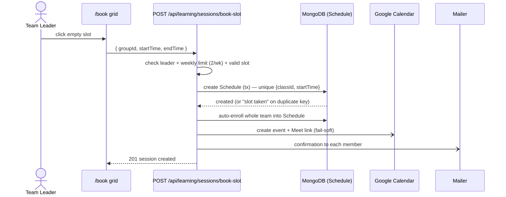
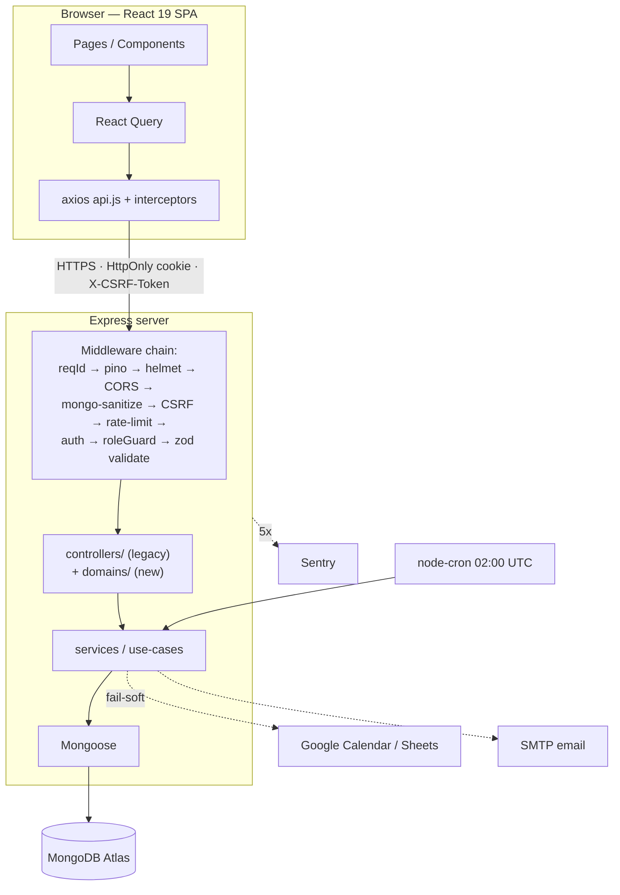
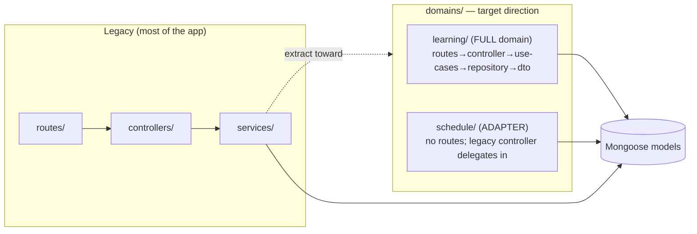

# System Overview — TMS v2 (becoming an Internal LTMS)

> **Purpose:** one orientation page — what the system is, how it works, how it's
> built, and **where we are** on the journey from a Training Management System
> to an Internal Learning/Training Management System for about 1000 employees.
> For exhaustive code-truth detail see [`current-system-map.md`](current-system-map.md);
> for the forward plan see [`lms-roadmap.md`](lms-roadmap.md).

---

## 1. What it is & who uses it

TMS v2 is an **internal training platform**: it schedules classes, lets teams
book sessions, records attendance, captures assessments/feedback, issues
certificates, and exports HR reports — replacing scattered Excel/Sheets. It is
mid-migration into an **Internal LTMS** focused on training ops + compliance, not
a commercial LMS clone or SCORM-first content platform.

| Role | Who | Can do |
|------|-----|--------|
| **Admin** | HR / L&D | Everything: users, classes, teams, schedules, reports, system config |
| **Teacher** | Facilitator | See assigned schedules, mark attendance, grade evaluations |
| **Participant** | Learner | See own group's schedule, **book slots if team leader**, view own scores |

---

## 2. Core workflow — the booking model (counter-intuitive, get this right)

Admins do **not** pre-create sessions. The **team leader** self-creates them by
clicking an empty cell on the `/book` grid. Constraints: exactly **1 hour**,
only **5 fixed slots**, max **2 / week / team**. The DB unique index
`{classId, startTime}` is the final guard against double-booking.



---

## 3. Architecture at a glance

Single Node service: Express API + (in prod) the built React SPA. React Query
owns all server state on the client; every write carries a CSRF token.



**Request lifecycle:** browser → axios (`/api/*`, cookie + CSRF) → middleware
chain → controller/domain → service → Mongoose → response; mutations write an
**audit log** asynchronously; unexpected 5xx go to Sentry.

---

## 4. Codebase shape — the modular-monolith migration

Two coexisting styles. New work goes into `domains/`; don't pile logic back into
big legacy controllers.



- **Full domain** (`learning/`): owns its routes at `/api/learning/*`.
- **Adapter** (`schedule/`): no routes; the legacy `scheduleController`
  delegates `update`/`delete` into it — the incremental-extraction pattern.

---

## 5. Data model

Legacy collection names stay; the L&D vocabulary is layered on via DTOs.

```mermaid
erDiagram
    LearningProgram ||--o{ Class : "programId"
    Class ||--o{ Team : "classId"
    Class ||--o{ Schedule : "classId"
    Class ||--o{ Evaluation : "classId"
    User ||--o{ Team : "leader / members"
    Team ||--o{ Schedule : "bookedTeamId"
    User ||--o{ Enrollment : "userId"
    Team ||--o{ Enrollment : "teamId"
    Schedule ||--o{ Attendance : "scheduleId"
    User ||--o{ Attendance : "userId"
    User ||--o{ Evaluation : "userId"
```

| Legacy model | Target concept | Migration status |
|---|---|---|
| `Class` | **Cohort** | DTO via `/api/learning/cohorts` ✅ |
| `courseName` (enum) | **Program** (`LearningProgram`) | ✅ done (`Class.programId`) |
| `Schedule` | **Session** | adapter `/api/learning/sessions` ✅ |
| `Team` | **LearningGroup** | ❌ not migrated |
| `Evaluation` | legacy English rubric | kept for compatibility; `Assessment` v1 is live ✅ |
| `Enrollment` | cohort-based enrollment | ✅ live; legacy team enrollment still supported |
| `Assessment`, `AssessmentAttempt`, `AssessmentQuestion` | quiz engine + question bank | ✅ v1 live |
| `Certificate`, `Feedback`, `LearningPath`, `Assignment`, `NotificationLog` | compliance, learner paths, assignment due dates, email idempotency logs | ✅ v1 live |

Key unique indexes (final integrity guards): `Schedule {classId,startTime}`,
`Attendance {scheduleId,userId}`, `Evaluation {classId,userId}`,
`User.empCode`, `LearningProgram.code`/`name`.

---

## 6. Security & cross-cutting (load-bearing — never bypass)

- **Auth:** JWT in HttpOnly cookie (24h) + optional TOTP MFA + backup codes;
  changing password kills all sessions; account locks after 5 failed logins.
- **Authz is two-layer:** `roleGuard()` (can this role hit this URL?) **then**
  `policy/*` (can THIS actor touch THIS doc?) — policies called directly in
  controllers (`decision.allowed` → `policyDeny`).
- **CSRF** on every write, **rate limiters** per-route + global, **helmet** CSP,
  **express-mongo-sanitize**, **zod** validation.
- **Soft delete** everywhere (recoverable trash); **audit log** every mutation
  (730-day TTL); nightly **reconcile** job flags data drift.

See [`.claude/rules/security-and-auth.md`](../.claude/rules/security-and-auth.md)
and [`route-permission-matrix.md`](route-permission-matrix.md).

---

## 7. You are here — migration scorecard

Re-architecture into an L&D platform runs in phases (full detail:
[`development-roadmap.md`](development-roadmap.md)).

| Phase | Theme | Progress |
|------|-------|---------:|
| 0 | Architecture baseline + safety net (ADRs, tests, domain convention) | ~92% |
| 1 | Backend modular-monolith refactor (extract legacy → `domains/`) | ~59% |
| 2 | Learning catalog + generic cohort model (`LearningProgram`) | ~95% |
| 3 | Multi-program enrollment + session scheduling | ~78% |
| 4 | Frontend L&D workspace (CRUD UI) | ~80% |
| 5 | Reporting, completion, feedback | ~72% |
| 6 | PostgreSQL decision gate | 0% |

**Today:** Wave A (Foundation) is complete — all 4 `schedulingMode`s enforced,
cohort-based enrollment + self-enroll live, the Learning page has CRUD, and a
capability-based authz layer gates the learning routes. Wave B is progressing:
`completionPolicy` is enforced (attendance % + assessment + feedback);
certificates, public verification, feedback UI, assessment v1, question bank,
manual grading, completion reports, and rollups are live. Wave C has started:
learner catalog, self-enroll, prerequisite gating, sequenced paths, admin paths
UI, and learner path progress are live. Wave D has started: cron
self-monitoring, org model/manager dashboard, assignment + due dates v1, and
assignment reminders/manager escalation v1 are live. For 1000 employees, next
platform gaps are Google OIDC, Google Directory sync, compliance report depth,
recertification, broader notification surfaces, and generic scheduling.
→ see [`lms-roadmap.md`](lms-roadmap.md).

**Stack:** React 19 + Vite 8 + Tailwind 4 / Express 4 + Mongoose 8 + MongoDB;
server/client test suites, Playwright e2e, 7 CI gates, deployed on Render.

## 8. Delivery discipline — no feature factory

Every milestone must be wired before the next feature starts:

- backend route/use-case works with real authz/capability rules;
- frontend entrypoint exists when user value depends on UI;
- i18n en updated for user-facing strings;
- mutations audit and soft-delete where applicable;
- reports/completion/certificates/notifications consume new data when relevant;
- tests cover happy path, permission denial, and one core edge case;
- manual smoke flow is documented or run.

---

## 9. Source-of-truth index

| Doc | What |
|-----|------|
| [`../AGENTS.md`](../AGENTS.md) | Agent reference contract for Codex/Claude |
| [`development-roadmap.md`](development-roadmap.md) | Living tracker and next work |
| [`current-system-map.md`](current-system-map.md) | Exhaustive code-truth map (routes, models, services) |
| [`route-permission-matrix.md`](route-permission-matrix.md) | Per-route read/write access |
| [`handoff-2026-06-01.md`](handoff-2026-06-01.md) | Phase progress + prioritized task list |
| [`lms-roadmap.md`](lms-roadmap.md) | Internal LTMS strategy and 6-month direction |
| [`ltms-gap-analysis.md`](ltms-gap-analysis.md) | LTMS gap analysis + proposed priority re-sequence (decision doc) |
| [`decisions/`](decisions/) | Locked architecture decisions (ADRs) |
| [`../CLAUDE.md`](../CLAUDE.md) + [`../.claude/rules/`](../.claude/rules/) | Engineering conventions |
| `/api/docs` | Swagger UI (server running) |
