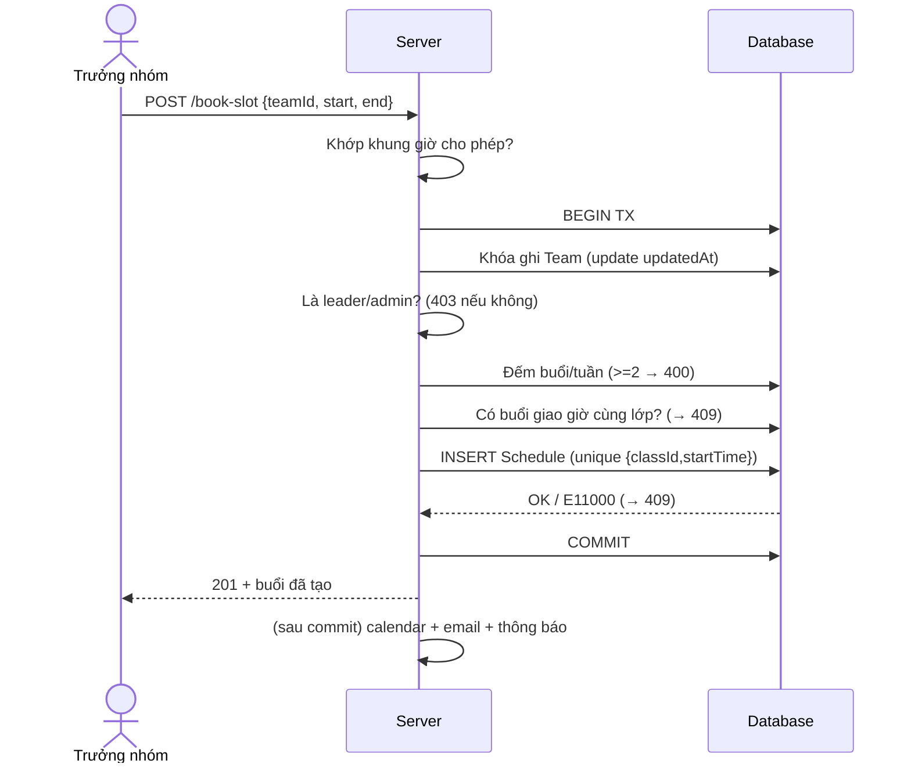
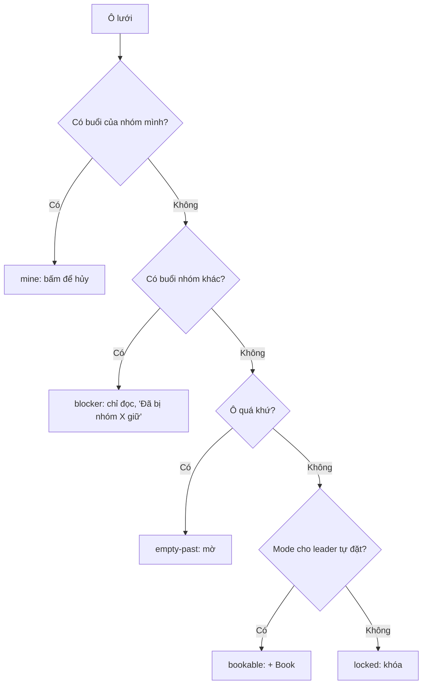

# Cơ chế "Booking nhóm + xem lịch của nhau" — Spec để dựng lại trên web khác

> Tài liệu này mô tả **đầy đủ và độc lập** (stack-agnostic) cơ chế đặt lịch theo
> nhóm của lớp English trong TMS v2, để bạn (hoặc 1 AI khác) dựng lại trên một
> web hoàn toàn mới — không cần đọc code gốc.
>
> Nguồn trích: `docs/specs/scheduling-and-booking/spec.md`,
> `server/services/scheduleService.js`, `server/models/Schedule.js`,
> `server/domains/schedule/*`, `client/src/features/schedule/BookClassPage.jsx`,
> `client/src/lib/{scheduling-slots,booking-cell-state}.js`.

---

## 0. Ý tưởng cốt lõi (đọc cái này trước, mọi thứ khác xoay quanh nó)

Hầu hết app đặt lịch làm theo kiểu: **admin tạo sẵn các buổi học**, học viên vào
"đăng ký chỗ trống". Cơ chế này **ngược lại**:

- Admin **KHÔNG** tạo sẵn buổi học.
- Admin chỉ tạo: một **Lớp (Class)** + một **Nhóm (Team)** gán vào lớp đó, và chỉ
  định một **Trưởng nhóm (Leader)**.
- **Chính trưởng nhóm tự tạo buổi học**: mở lưới thời gian (timetable) → bấm vào
  một ô trống → hệ thống tạo ngay một buổi (Schedule) và **tự động ghi danh cả
  nhóm** vào buổi đó.

> **Ví dụ đời thường:** giống như một phòng họp chung của cả tầng. Quản lý không
> xếp lịch họp cho từng phòng ban. Thay vào đó mỗi trưởng phòng tự nhìn bảng đặt
> phòng, thấy ô nào trống thì tự đặt cho phòng mình. Ai cũng **nhìn thấy** ô nào
> đã bị nhóm khác giữ (để né), nhưng **không giành** được ô đã có người giữ.

Hai thứ bạn hỏi nằm gọn trong đây:
1. **Booking nhóm** = trưởng nhóm bấm ô trống → tạo buổi + ghi danh cả nhóm.
2. **Xem lịch của nhau** = lưới hiển thị cả buổi của các nhóm khác (chỉ đọc), để
   chọn giờ trống mà không đụng nhau.

---

## 1. Các thực thể (data model) — tối giản

Mô tả không phụ thuộc DB. Đặt tên field giữ nguyên để dễ đối chiếu code gốc.

### `Class` (Lớp — cái "khung" mà các nhóm cùng đặt vào)
| Field | Kiểu | Ghi chú |
|---|---|---|
| `id` | id | |
| `classCode` | string | mã hiển thị (vd "ENG-01") |
| `courseName` | string | tên khóa |
| `status` | enum | `Ongoing` / ... (chỉ lớp `Ongoing` mới cho đặt) |

### `Team` (Nhóm)
| Field | Kiểu | Ghi chú |
|---|---|---|
| `id` | id | |
| `name` | string | |
| `classId` | ref Class | nhóm thuộc 1 lớp; **chưa gán lớp thì không đặt được** |
| `leaderId` | ref User | chỉ người này (hoặc Admin) được đặt cho nhóm |
| `members[]` | ref User + `status` | mỗi member có `status: Active \| Dropped` |
| `departmentId` | ref Department (nullable) | **BU** mà nhóm thuộc về — để quy buổi về BU khi **thống kê** (§3b) |

### `Schedule` (Buổi học — thực thể trung tâm)
| Field | Kiểu | Ghi chú |
|---|---|---|
| `id` | id | |
| `classId` | ref Class **(bắt buộc)** | buổi thuộc lớp nào — **đơn vị chống trùng** |
| `bookedTeamId` | ref Team (nullable) | nhóm sở hữu buổi |
| `startTime` / `endTime` | datetime (UTC) | **lưu UTC**, hiển thị theo giờ VN |
| `enrolledUsers[]` | ref User | **ảnh chụp (snapshot)** member Active lúc đặt — dùng cho điểm danh |
| `departmentId` | ref Department (nullable) | **snapshot** BU của nhóm lúc đặt — để **thống kê** số buổi theo BU nhanh (§3b) |
| `capacity` | number (default 9) | sức chứa buổi |
| `status` | enum `scheduled` / `cancelled` | hủy = đổi status, **không xóa cứng** |
| `cancelledAt/By/Reason` | | lưu khi hủy (audit) |
| `roomLink` / `meetLink` | string | link phòng học online (tùy chọn) |

> **Bất biến (invariant) ở tầng schema:** `endTime > startTime` (validate ngay ở
> model, phòng cả khi insert thẳng qua tool DB).

### `Setting: ALLOWED_TIME_SLOTS` (cấu hình khung giờ cho đặt)
- Mảng các khung giờ **theo giờ tường VN**: `[{ sh, sm, eh, em }, ...]`
  (start hour/minute, end hour/minute). Cho phép phút lẻ và độ dài bất kỳ.
- **Mặc định:** 5 khung 1 tiếng: `10–11, 11–12, 13–14, 14–15, 15–16`
  (Asia/Ho_Chi_Minh).
- Mảng rỗng/sai định dạng ⇒ **fail-closed**: không cho đặt buổi mới (lịch sử vẫn
  hiển thị).

### `Department` (BU) — để thống kê theo phòng ban
- Dùng cho **thống kê số buổi theo BU** (§3b) — *chỉ báo cáo, KHÔNG chặn đặt*.
- `Department`: `id`, `name`, `code` (vd "ENG", "HR"), soft-delete. User gắn vào BU
  qua `departmentId`; nhóm gắn BU qua `Team.departmentId`; mỗi buổi chụp
  `Schedule.departmentId` lúc đặt để quy về BU.

---

## 2. Sáu luật nghiệp vụ (Business Rules) — đây là phần "hồn" của tính năng

| # | Luật | Vì sao |
|---|---|---|
| **BR-1** | Buổi học do **trưởng nhóm** tạo, không phải admin xếp sẵn | giảm tải vận hành |
| **BR-2** | Một ô lịch (lớp + giờ) **không bao giờ bị đặt trùng**, kể cả khi 2 người bấm cùng lúc | tài nguyên dùng chung |
| **BR-3** | Mỗi nhóm tối đa **2 buổi / tuần** (Thứ 2 – CN) | không nhóm nào ôm hết slot |
| **BR-4** | Buổi học phải rơi đúng **khung giờ cho phép** | lịch gọn, dễ đối chiếu |
| **BR-5** | Trưởng nhóm **thấy** ô nhóm khác đã giữ nhưng **không giành** được | chọn giờ trống mà không đụng |
| **BR-6** | Admin **toàn quyền** (tạo/sửa/xóa buổi bất kỳ) — nhưng vẫn không vượt luật trùng/khung giờ | override vận hành |

> **Lưu ý:** *Thống kê số buổi theo BU* (§3b) KHÔNG phải một luật đặt buổi — nó là
> tầng **báo cáo**, không chặn việc đặt. Vì vậy không nằm trong bảng luật trên.

---

## 3. Luồng đặt buổi (booking flow) — chi tiết từng bước

Đây là logic của `POST /api/schedules/book-slot` với body `{ teamId, startTime, endTime }`.

```
INPUT: teamId, startTime, endTime, requestUser (người đang đăng nhập)

1. VALIDATE KHUNG GIỜ
   - start/end là ngày hợp lệ, end > start
   - đổi start/end sang giờ tường VN, phải KHỚP CHÍNH XÁC một khung trong
     ALLOWED_TIME_SLOTS (đúng cả giờ lẫn phút). Không khớp → 400
       "Please select an allowed time slot."

2. MỞ TRANSACTION (atomic — tất cả hoặc không gì cả):

   2a. KHÓA GHI NHÓM (chống đua cùng nhóm)
       - update Team.updatedAt = now  → buộc DB xếp tuần tự các request
         cùng một teamId. (Hai request cùng nhóm không chạy song song.)

   2b. KIỂM TRA NHÓM
       - Team tồn tại? không → 404
       - Team.classId có chưa? chưa → lỗi "team chưa gán lớp"

   2c. PHÂN QUYỀN (BR-1)
       - Nếu requestUser KHÔNG phải Admin:
           phải là team.leaderId, nếu không → 403
           "Only Admin or the Team Leader can book for this team"

   2d. CHỤP ROSTER (BR-1)
       - enrolledUsers = các member có status === 'Active' (bỏ Dropped)

   2e. KIỂM TRA ĐẶT ĐƯỢC KHÔNG (thứ tự: tuần → trùng → sức chứa)
       - CAP TUẦN (BR-3): đếm số buổi 'scheduled' của teamId trong tuần
         [Thứ2 00:00 .. CN 23:59] chứa start. Nếu ≥ 2 → 400
       - CHỐNG TRÙNG (BR-2): có buổi 'scheduled' nào của classId mà
         startTime < end VÀ endTime > start (giao nhau)? có → 409
         "This time slot is already taken"
       - SỨC CHỨA: nếu số người ghi danh > capacity hiệu lực → 422

   2f. TẠO Schedule { classId, bookedTeamId, startTime, endTime, enrolledUsers,
       departmentId }   ← stamp team.departmentId để THỐNG KÊ theo BU (KHÔNG chặn gì)

3. BẮT LỖI E11000 (unique index) → 409 (đua đồng thời, xem mục 4)

4. SAU KHI COMMIT (best-effort, fail-soft — hỏng cũng KHÔNG rollback booking):
   - tạo sự kiện Google Calendar (+ link Meet) nếu có cấu hình
   - gửi email xác nhận cho người đặt
   - bắn thông báo in-app cho cả roster
```

> **Điểm tinh tế quan trọng:** bước 4 nằm **ngoài** transaction. Booking phải
> thành công trước; calendar/email chỉ là "tô điểm thêm". Nếu nhét vào trong
> transaction, một lần gọi Calendar lỗi sẽ rollback cả buổi học — không mong muốn.

### Sơ đồ tuần tự (rút gọn)



---

## 3b. Thống kê số buổi theo BU (Department)

> Owner (2026-06-17): **hiện tại CHỈ cần THỐNG KÊ** — báo cáo mỗi BU đặt bao nhiêu
> buổi theo kỳ. **CHƯA chặn đặt (chưa set cap).** Mục này cố tình thiết kế để *sau
> này thêm cap chỉ tốn 1 bước* mà không phải đổi dữ liệu (xem "Forward-compatible").

### Ý nghĩa (plain)
Trả lời câu hỏi: *"Phòng ban (BU) X đã đặt bao nhiêu buổi học trong tháng/quý/năm
này?"* — để theo dõi khối lượng đào tạo theo phòng ban. **Không giới hạn, không
chặn** — chỉ đếm và hiển thị.

### Dữ liệu cần (tối thiểu)
- **`Department`** = BU (`code` ENG/HR..., soft-delete). User gắn BU qua
  `User.departmentId`; nhóm gắn BU qua **`Team.departmentId`**.
- **`Schedule.departmentId`** = **snapshot** BU của nhóm **ghi lúc đặt** (chụp giống
  `enrolledUsers`). Mấu chốt: stamp sẵn BU lên mỗi buổi ⇒ thống kê chỉ là 1 phép
  gom nhóm (group-by), không phải join Schedule→Team mỗi lần.

> Việc DUY NHẤT chạm vào luồng đặt buổi: lúc tạo `Schedule`, **stamp thêm
> `departmentId = team.departmentId`**. Không kiểm tra, không chặn ⇒ không đổi hành
> vi đặt buổi hiện tại.

### Kỳ (period) báo cáo
Tháng / quý / năm dương lịch theo giờ VN — là **tham số của báo cáo**, người xem
chọn kỳ + khoảng thời gian. Không cố định, không hardcode.

### Truy vấn thống kê (group-by)
```
GET /reports/sessions-by-bu?period=quarter&from=2026-01-01&to=2026-12-31

→ với mỗi BU, đếm Schedule WHERE
     status    = 'scheduled'            // (tùy chọn: tách cột 'cancelled' nếu muốn)
     startTime ∈ [from, to]
   GROUP BY departmentId (+ theo kỳ nếu muốn chia cột tháng/quý)

→ trả: [{ departmentId, code, name, count }, ...]   (sort theo count giảm dần)
```
- **Index** `{ departmentId, startTime }` giúp gom nhanh khi dữ liệu lớn.
- Buổi đã hủy có thể đếm thành cột riêng (để thấy tỉ lệ hủy) — tùy nhu cầu.

### Quyền xem
Báo cáo nội bộ ⇒ **Admin / Coordinator** (vai trò quản lý đào tạo). Không lộ cho
Participant/Teacher.

### UI gợi ý (tùy chọn)
- Bảng hoặc biểu đồ cột: mỗi BU một dòng/cột, số buổi theo kỳ; lọc theo khoảng thời gian.
- Drill-down: bấm 1 BU → list các nhóm + buổi của BU đó.

### Forward-compatible: sau này muốn SET CAP thì làm gì?
Vì đã có sẵn snapshot `Schedule.departmentId`, nâng lên *chặn đặt* chỉ cần:
1. Thêm config định mức (global `{ period, defaultLimit }` + override theo BU
   `{ departmentId, limit }` — pattern `Budget`).
2. Thêm **1 check** vào chokepoint `assertBookable`: đếm theo BU/kỳ y như truy vấn
   thống kê, `used >= limit` → 400; đặt sau cap tuần, trước chống trùng.
→ **Không đổi schema, không backfill.** Nên cứ làm thống kê trước (YAGNI).

### Pros/cons: đếm bằng snapshot vs join
| Cách | Ưu | Nhược |
|---|---|---|
| **Snapshot `Schedule.departmentId`** (khuyến nghị) | đếm 1 query + 1 index, nhanh; cố định BU tại lúc đặt; sẵn sàng cho cap sau này | nhóm đổi BU sau đó thì buổi cũ vẫn tính BU cũ (thường ĐÚNG về mặt thống kê lịch sử) |
| **Join Schedule→Team→departmentId** | luôn theo BU hiện tại của nhóm | đếm phức tạp (aggregation join), chậm; đổi BU làm lệch số liệu kỳ cũ |

### Câu hỏi mở (chốt sau khi dựng)
1. Kỳ hiển thị mặc định: **tháng / quý / năm**? (gợi ý: cho chọn, mặc định **quý**)
2. Có tách cột **buổi đã hủy** trong báo cáo không? (gợi ý: có — để thấy tỉ lệ hủy)
3. Buổi cohort **team-less** (nếu web mới có) quy về BU nào? (gợi ý: gom "Không xác
   định" hoặc bỏ qua — ngoài phạm vi English thuần)

---

## 4. Chống đặt trùng — **2 lớp** (đừng bỏ lớp DB)

Đây là phần dễ làm sai nhất. Chỉ kiểm tra ở tầng ứng dụng là **không đủ**: hai
request có thể cùng vượt qua bước "kiểm tra trùng" rồi cùng insert.

| Lớp | Cơ chế | Vai trò |
|---|---|---|
| **App** | (a) khóa ghi Team serialize request cùng nhóm; (b) truy vấn chống trùng trong transaction | chặn 99% trường hợp, cho thông báo đẹp |
| **DB** | **Unique index `{classId, startTime}`** (chỉ áp cho row `status='scheduled'` → *partial unique*) | **chốt chặn cuối** cho điều kiện đua; insert thứ 2 bị DB ném lỗi trùng khóa → app đổi thành **409** |

**Partial unique** (chỉ unique khi `status='scheduled'`) cho phép: buổi đã hủy
(`cancelled`) vẫn nằm cùng ô như lịch sử, mà ô đó vẫn đặt lại được.

> **Port sang DB khác:**
> - MongoDB: `partial unique index { classId:1, startTime:1 } where status='scheduled'`.
> - **PostgreSQL/MySQL:** `CREATE UNIQUE INDEX ... ON schedule(class_id, start_time) WHERE status='scheduled';` (Postgres hỗ trợ partial index trực tiếp). MySQL không có partial index → dùng cột sinh (generated column) hoặc unique trên `(class_id, start_time, status)` + dọn lịch sử khác cách.
> - **Luôn** bắt lỗi unique-violation và quy nó về 409 "ô đã có người đặt".

---

## 5. "Xem lịch của nhau" — cách hiển thị

### Server: một query trả TẤT CẢ buổi tương lai của lớp
```
GET /api/schedules/availability?classId=<id>
→ trả mọi Schedule có:
    startTime >= hôm nay (giờ VN)
    status = 'scheduled'
    classId = <id>   (lọc theo lớp đang chọn)
  kèm populate: classId(classCode,courseName), bookedTeamId(name)
  sort theo startTime
```
Lưu ý: query trả buổi của **mọi nhóm trong cùng lớp** — đó chính là cách trưởng
nhóm "thấy lịch của nhau".

> **Phạm vi chống trùng là theo LỚP.** Hai lớp khác nhau đặt cùng ô giờ vẫn OK —
> lưới chỉ load buổi của lớp đang chọn, nên lớp khác không bao giờ chặn ô của bạn.

### Client: xếp mỗi buổi vào ô (ngày × khung giờ) rồi phân loại

Mỗi ô lưới = `ngày (theo cột) | id khung giờ "HH:mm-HH:mm" (giờ VN)`.

Với mỗi ô, phân loại trạng thái (theo đúng thứ tự ưu tiên):

```
mySchedule = buổi trong ô này mà bookedTeamId === nhóm-đang-chọn
blocker    = buổi trong ô này của nhóm KHÁC

if mySchedule  → 'mine'        (xanh, "Mine" — bấm để HỦY)
elif blocker   → 'blocker'     (xám, "Đã bị <Tên nhóm> giữ" — chỉ đọc)
elif ô-quá-khứ → 'empty-past'  (mờ, không tương tác)
elif đặt-được  → 'bookable'    (viền đứt, "+ Book" — bấm để đặt)
else           → 'locked'      (khóa — do mode không cho leader tự đặt)
```

Quy tắc vàng: **buổi đã tồn tại (mine/blocker) luôn được hiển thị ở MỌI chế độ** —
chỉ có nút "+ Book" trên ô trống mới bị khóa. Tức là việc "thấy lịch của nhau"
không bao giờ bị ẩn đi.

### Sơ đồ trạng thái ô



---

## 6. Cấu hình khung giờ + timezone (đừng xem nhẹ)

- **Lưu UTC, hiển thị/validate theo giờ VN.** VN là `+07:00` cố định, không có DST
  → chỉ cần **một offset** (= 420 phút) để đổi qua lại giờ-tường ↔ UTC. Không phụ
  thuộc timezone của trình duyệt cho phần giờ trong ngày.
- **Đổi UTC → giờ VN:** dịch instant đi `+420 phút` rồi đọc các field UTC
  (`getUTCHours/getUTCMinutes`). Ngược lại khi đặt: lấy ngày × khung giờ VN, trừ
  `420 phút` ra UTC.
- **Validate khi admin lưu `ALLOWED_TIME_SLOTS`:** mỗi khung phải hợp lệ (giờ
  0–23, phút 0–59, end > start cùng ngày), **không trùng/đè nhau**. Mảng rỗng được
  chấp nhận (= tắt đặt lịch, lịch sử vẫn hiện).
- **Expose read-only cho mọi role** (`GET /config`) chỉ gồm:
  `{ timezone, utcOffsetMinutes, weeklyTeamLimit, slots[] }`, mỗi slot
  `{ id, label, startHour, startMinute, endHour, endMinute, durationMinutes }`.
  Lưới client render đúng khung cấu hình thật, không hardcode.
- **Buổi "off-policy"** (giờ không khớp khung nào — vd dữ liệu cũ): vẫn hiện trên
  lưới ở hàng riêng **chỉ đọc**, không cho đặt mới vào đó.

---

## 7. Hủy buổi — hủy "mềm" (durable cancel)

- Hủy = đổi `status: 'cancelled'` + ghi `cancelledAt/By/Reason`. **Không xóa cứng.**
- Roster + dữ liệu điểm danh **được giữ nguyên** (cần cho báo cáo/audit).
- Ô được giải phóng: vì unique index là *partial* (chỉ áp `scheduled`), nên đặt
  lại được ngay; mọi query vận hành (availability, cap tuần, điểm danh...) đều bỏ
  qua row `cancelled`.
- **Không cho hủy buổi đã bắt đầu** (`startTime <= now` → 409) — bảo toàn lịch sử
  điểm danh.
- Đua hủy đồng thời: dùng update có điều kiện (`{_id, status:'scheduled'}`) → đúng
  1 thắng (200), cái kia 409 "đã hủy rồi".

---

## 8. API tối thiểu (core surface)

| Method · Route | Ai gọi | Việc |
|---|---|---|
| `GET /schedules/availability?classId` | đã đăng nhập | lấy mọi buổi tương lai của lớp (xem lịch nhau) |
| `POST /schedules/book-slot` `{teamId,start,end}` | Admin / Trưởng nhóm | đặt buổi mới |
| `DELETE /schedules/:id/cancel` | Admin / Trưởng nhóm | hủy buổi nhóm mình |
| `GET /schedules/my-class` | học viên | buổi sắp tới của nhóm/lớp mình |
| `GET /sessions/config` | mọi role đã đăng nhập | đọc khung giờ + offset + cap tuần |
| `POST/PUT/DELETE /schedules` | Admin | override tạo/sửa/xóa |
| `PUT /settings` (ALLOWED_TIME_SLOTS) | Admin | cấu hình khung giờ |
| `GET /reports/sessions-by-bu?period=&from=&to=` | Admin / Coordinator | **thống kê** số buổi theo BU/kỳ (§3b) |

**Bảo vệ bắt buộc trên các route ghi:** xác thực đăng nhập, CSRF token, rate-limit
riêng cho đặt/hủy, validate body (vd zod). Phân quyền **2 lớp**: lớp role (URL này
role nào vào được) + lớp tài nguyên (user NÀY có quyền với buổi/nhóm NÀY không).

---

## 9. Các tình huống biên (edge cases)

| Tình huống | Hành vi | Cách xử lý |
|---|---|---|
| Không phải leader/admin | 403 | đặt qua leader/admin |
| Nhóm chưa gán lớp | lỗi | admin gán lớp trước |
| Giờ ngoài khung cho phép | 400 | chọn khung hợp lệ |
| Trùng giờ cùng lớp | 409 | chọn ô trống |
| Hai người đặt y hệt cùng lúc | đúng 1 thành công, 1 nhận 409 (E11000) | thử ô khác |
| Đã đủ 2 buổi/tuần (nhóm) | 400 | tuần sau hoặc hủy bớt |
| `end <= start` | lỗi validate | sửa khung giờ |
| Calendar/email lỗi | booking vẫn thành công, chỉ log | không cần làm gì |

---

## 10. CỐT LÕI vs MỞ RỘNG — port cái gì? (khuyến nghị KISS)

App gốc tích lũy nhiều thứ quanh cơ chế này. Nếu web mới chỉ cần đúng "booking
nhóm + xem lịch nhau" thì **chỉ cần phần CỐT LÕI** dưới đây; phần MỞ RỘNG bỏ qua
được mà không ảnh hưởng tính năng chính.

### ✅ CỐT LÕI (bắt buộc để có đúng tính năng bạn hỏi)
- `Class`, `Team` (có leader + members.status), `Schedule`, `Setting ALLOWED_TIME_SLOTS`
- Luồng booking (mục 3) + chống trùng 2 lớp (mục 4)
- Query availability theo lớp + phân loại ô lưới (mục 5)
- Cap tuần (BR-3), khớp khung giờ (BR-4), phân quyền leader/admin (BR-1, BR-6)
- Hủy mềm (mục 7), timezone/config (mục 6)

### ➕ MỞ RỘNG (tùy nhu cầu — KHÔNG cần cho bản đầu)
| Tính năng | Nên port khi nào |
|---|---|
| **Thống kê số buổi theo BU** (§3b) | **owner yêu cầu — hiện CHỈ thống kê, CHƯA chặn đặt.** Cần `Department` + `Team.departmentId` + snapshot `Schedule.departmentId` + 1 endpoint báo cáo (group-by). *Set cap (chặn đặt) là bước sau — field đã sẵn, không phải đổi schema* |
| **Scheduling modes** (`leader_booking`/`admin_scheduled`/`self_enroll`/`nomination`) | khi cần cả kiểu admin xếp lịch + học viên tự đăng ký theo cohort. Bản English thuần chỉ cần `leader_booking` (fallback mặc định) |
| **Cohort booking** (buổi không gắn Team, ghi danh theo cohort) | khi có lớp không chia nhóm |
| **Rooms + Office** (phòng vật lý, khóa `{roomId,startTime}`) | khi cần xếp phòng học offline |
| **Trainers** (giảng viên nội bộ/ngoài per buổi) | khi cần gán giảng viên & chống trùng giảng viên |
| **Waitlist** (hàng đợi FIFO khi buổi đầy, tự đẩy lên) | khi buổi hay đầy chỗ |
| **Capacity policy theo program** | khi sức chứa khác nhau theo chương trình |
| **Google Calendar / email / in-app notify** | khi cần đồng bộ lịch & nhắc |
| **Audit log mọi mutation** | khi cần tuân thủ/đối soát |

> **Khuyến nghị:** dựng **bản CỐT LÕI trước**, chạy ổn, rồi thêm MỞ RỘNG theo nhu
> cầu thật. Đừng bê nguyên cả `scheduling-mode-policy`, room-lock, waitlist vào
> bản đầu — đó là độ phức tạp app gốc tích lũy qua nhiều "wave", không phải thứ
> "booking nhóm + xem lịch nhau" cần để hoạt động.

---

## 11. Lựa chọn khi port (pros/cons + khuyến nghị)

### A. Chốt chặn chống đua: DB unique index vs chỉ check ở app
| Phương án | Ưu | Nhược |
|---|---|---|
| **App-only** (chỉ query check trùng) | dễ làm | **SAI dưới tải đồng thời** — 2 insert lọt cùng lúc → đặt trùng |
| **App + DB unique** (khuyến nghị) | đúng tuyệt đối kể cả đua | cần DB hỗ trợ partial/conditional unique |

→ **Khuyến nghị: App + DB unique.** Đây là điểm dễ bỏ nhất và là nguyên nhân lỗi
"hai nhóm cùng giữ một ô". Đừng lược bỏ.

### B. Phạm vi chống trùng: theo Lớp vs toàn hệ thống
| Phương án | Ưu | Nhược |
|---|---|---|
| **Theo Lớp** (gốc: `{classId,startTime}`) | nhiều lớp song song cùng giờ OK; đúng mô hình "phòng riêng mỗi lớp" | nếu thực tế dùng chung phòng vật lý thì chưa đủ (cần thêm khóa room) |
| **Toàn hệ thống** | 1 ô giờ = 1 buổi duy nhất | quá chặt nếu có nhiều phòng/lớp |

→ **Khuyến nghị: theo Lớp** cho bản English (mỗi lớp là một "không gian" riêng).
Thêm khóa room chỉ khi có phòng vật lý dùng chung.

### C. Hủy: soft (đổi status) vs hard delete
→ **Khuyến nghị: soft** (giữ lịch sử + điểm danh cho báo cáo; ô vẫn đặt lại được
nhờ partial unique). Hard delete làm mất bằng chứng tuân thủ.

---

## 12. Checklist dựng lại (gợi ý thứ tự)

- [ ] Model `Class`, `Team` (leader + members.status), `Schedule` (+ validate end>start)
- [ ] `Setting ALLOWED_TIME_SLOTS` + helper đổi giờ VN ↔ UTC (offset 420, no DST)
- [ ] **Partial unique index `{classId,startTime}` where status='scheduled'**
- [ ] `GET /config` (đọc khung giờ cho client render lưới)
- [ ] `GET /availability?classId` (xem lịch nhau)
- [ ] `POST /book-slot` (transaction: lock team → authz → snapshot → cap tuần → trùng → sức chứa → insert → bắt E11000→409)
- [ ] `DELETE /:id/cancel` (soft, chặn buổi đã bắt đầu, update có điều kiện)
- [ ] Lưới client: bucket buổi vào ô + phân loại mine/blocker/empty-past/bookable
- [ ] Bảo vệ ghi: auth + CSRF + rate-limit + validate + authz 2 lớp
- [ ] **Thống kê theo BU (§3b):** `Department` + `Team.departmentId` + stamp snapshot `Schedule.departmentId` lúc đặt; endpoint `GET /reports/sessions-by-bu` (group-by BU + kỳ); index `{departmentId, startTime}`. *Chưa cần enforce cap — chỉ báo cáo.*
- [ ] (tùy chọn) calendar/email/notify/audit/waitlist/rooms/trainers

---

## Câu hỏi chưa rõ (cần bạn xác nhận để mình tinh chỉnh nếu muốn)

1. Web mới của bạn dùng **stack gì** (DB là Mongo, Postgres, MySQL...? framework
   nào)? — để mình ghi đúng cú pháp index/transaction tương ứng.
2. Bạn chỉ cần **kiểu leader tự đặt** (English thuần) hay cần cả kiểu admin xếp
   lịch / học viên tự đăng ký?
3. Có **phòng học vật lý dùng chung** không (cần khóa phòng) hay chỉ online/lớp
   riêng?
4. Có cần **đồng bộ Google Calendar + email** ở bản đầu không, hay để sau?
